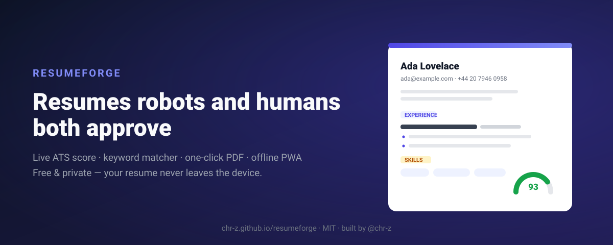

<div align="center">



# 📄 ResumeForge

**ATS-friendly resume builder with a live readiness score — free, private, offline-first.**
**Construtor de currículo amigável para ATS com nota de prontidão ao vivo — grátis, privado, offline.**

[](https://github.com/chr-z/resumeforge/actions/workflows/ci.yml)
[](https://github.com/chr-z/resumeforge/actions/workflows/pages.yml)
[](LICENSE)
[](#internationalization--internacionaliza%C3%A7%C3%A3o)
[](package.json)
[](manifest.json)

🔗 **Live demo → [chr-z.github.io/resumeforge](https://chr-z.github.io/resumeforge/)** · no signup, works offline after first load

</div>

---

75% of resumes are filtered out by ATS software before a human ever reads them. ResumeForge
fixes that in real time: as you type, a **readiness score** (0–100) checks the 10 things
screening software actually looks at — parseable dates, quantified achievements, action verbs,
keyword coverage — and tells you exactly what to fix. Then export a **clean single-column PDF**
that any parser can read.

Everything runs in your browser. No account, no server, no telemetry — your resume is nobody's
business but yours.

> 🇧🇷 75% dos currículos caem no filtro do ATS antes de um humano ler. O ResumeForge dá uma **nota
> de prontidão ao vivo**, aponta o que corrigir (datas legíveis, resultados com números, verbos de
> ação, palavras-chave da vaga) e exporta um PDF limpo que qualquer robô entende. Interface em
> português ou inglês.

## ✨ Features

| | |
|---|---|
| 🎯 **Live ATS score** | Weighted 0–100 gauge across contact info, summary, experience dates, achievement bullets, education and skills — with an actionable fix-list |
| 🔑 **Keyword matcher** | Paste the job posting keywords; word-boundary matching (`java` ≠ `javascript`) returns matched vs missing with coverage % |
| 🔢 **Quantified-impact detector** | Flags when fewer than half your bullets contain numbers, % or money — the #1 senior-signal recruiters scan for |
| ⚡ **Action-verb check** | Detects weak openers ("responsible for…") in EN and PT-BR |
| 📅 **Human-readable durations** | `Mar 2022 – Present · 2 yrs` computed from EN *and* PT month names (`dez/2023` parses fine) |
| 🖨️ **One-click clean PDF** | Print stylesheet strips all UI chrome — only the single-column sheet hits the paper, exactly what parsers want |
| 💾 **JSON export/import** | Your data, portable: one click saves everything; import restores it anywhere |
| 🌎 **EN / PT-BR interface** | Header switcher, persisted choice, plain JSON dictionaries — add a language by adding one file |
| 📲 **Installable PWA** | Manifest + service worker with stale-while-revalidate caching: opens offline, installs on phone/desktop |
| 🛡️ **Private by design** | Zero runtime dependencies, zero network calls, zero cookies, zero telemetry |

## 🧠 How the scoring works (the senior-engineer part)

Not vibes — a weighted checklist mirroring how real screeners behave:

```
contact (name+email)      −25 if missing      · malformed phone −3
summary                   −10 missing         · outside 20–120 words −5
experience                −30 none            · undated roles −7 · <2 bullets/role −13
                          <50% quantified −5  · zero action verbs −5
education                 −10 if empty
skills                    −20 under 5 skills
formatting                ALL-CAPS words −5   · floor at 0, cap at 100
```

Keyword matching uses **word boundaries** so listing JavaScript never satisfies a `java`
requirement, and dedupes case-insensitively. Dates accept ISO (`2023-03`), English (`Mar 2023`)
and Portuguese (`dez/2023`) formats, and "Present"/"Atual" ranges compute live durations.
Every rule is covered by **14 unit tests** running on Node's built-in test runner in CI.

## 🚀 Quick start

1. Open the [live demo](https://chr-z.github.io/resumeforge/)
2. Click **Load sample** to see a 93-score resume in 5 seconds
3. Make it yours — watch the gauge react to every edit
4. Paste the job posting keywords into the matcher and close the gaps
5. Hit **Download PDF** (or install the PWA and work offline)

## 📸 Screenshots

| Editor + live score | Keyword matcher |
|---|---|
|  | Score reacts as you type; fix-list tells you what to change |

## 💰 Pricing

| | Free | Pro *(planned)* |
|---|---|---|
| Price | **$0** forever | $19 one-time |
| Resume builder + ATS score | ✅ | ✅ |
| Keyword matcher | ✅ | ✅ |
| PDF export | ✅ | ✅ |
| Multiple resumes | — | ✅ |
| Premium templates | — | ✅ |
| Tailored cover letters | — | ✅ |

No ads, no tracking, no dark patterns. The app works fully offline once loaded.

## 🗺️ Roadmap

- [ ] v1.1 — multiple resume profiles + duplicate
- [ ] v1.2 — extra ATS-friendly templates (serif, two-tone)
- [ ] v1.3 — import from LinkedIn / JSON Resume standard
- [ ] v1.4 — cover-letter forge sharing your master profile
- [ ] v2.0 — optional Pro license key (offline validation, like our other ForgeKit apps)

## ♿ Accessibility

Keyboard-navigable forms with visible focus rings, `aria-live` on the score panel, semantic
landmarks, reduced-motion support, and color pairs tested for WCAG AA contrast.

## 🏗️ Tech notes

Vanilla JS ES modules, **zero runtime dependencies** (~15 KB of app code). Business logic lives
in [`js/core.js`](js/core.js) as pure functions — tested with Node's built-in runner:

```bash
node --test tests/*.test.js   # 14 tests, no npm install needed
```

Deployed as a static site on GitHub Pages (CI runs tests before publishing).

## Internationalization / Internacionalização

Interface available in **English** and **Português (BR)** via the header selector — persisted in
`localStorage`, auto-detected from the browser on first visit. All strings live in
[`locales/en.json`](locales/en.json) and [`locales/pt-BR.json`](locales/pt-BR.json); adding a
language is one JSON file away.

## 🤝 Contributing

Issues and PRs welcome — see [CONTRIBUTING.md](CONTRIBUTING.md). Bug reports with a failing
`node --test` case get priority.

## 📄 License

[MIT](LICENSE) — use it, fork it, ship it.

---

<div align="center">

**Built by [@chr-z](https://github.com/chr-z)** · part of the *ForgeKit Labs* suite —
PriceCraft · ContractKit · LinkForge · MenuPulse · ResumeForge

</div>
